# 1.Explica métodos para 'abrir' una consola/shell a un contenedor que se está ejecutando
Se puede abrir desde la terminal con el comando docker exec -it, por ejemplo:

    docker exec -it servidor bash

También se puede abrir dando click derecho sobre el container y
seleccionando “attach shell”.

# 2.En el contenedor anterior con que opciones tiene que haber sido arrancado para poder interactuar con las entradas y salidas del contenedor
Debe arrancarse con las opciones "-it".
 
# 3.¿Cómo sería un fichero docker-compose para que dos contenedores se comuniquen entre si en una red solo de ellos?
Para que dos contenedores se comuniquen entre si en una red solo de ellos debemos primero crear una network de la siguiente forma:

    docker create network bind9_subnet

Depués personalizariamos los parámetros de enta forma:
    
        docker network create \
    --driver=bridge \
    --subnet=172.28.0.0/16 \
    --ip-range=172.28.5.0/24 \
    --gateway=172.28.5.254 \

Y en ambos contenedores deberiamos añadir la sección:

    networks:
            bind9_subnet: 
            external: true
# 4.¿Qué hay que añadir al fichero anterior para que un contenedor tenga la IP fija?
Para que un contenedor tenga una ip fija tendríamos que añadir esta sección

     networks:
         bind9_subnet:
             ipv4_address: 172.28.5.3
# 5.¿Que comando de consola puedo usar para saber las ips de los contenedores anteriores? Filtra todo lo que puedas la salida.
Para saber las IPs de los contenedores podemos utilizar el siguiente comando:

    docker network inspect [Nombre de la red] 
# 6.¿Cual es la funcionalidad del apartado "ports" en docker compose?
El apartado "ports" se utiliza para especificar cómo se deben mapear
los puertos entre el host y el contenedor. Permite definir cómo las aplicaciones dentro de los contenedores pueden ser accedidas desde el host o desde fuera de la red del contenedor.
# 7.¿Para que sirve el registro CNAME? Pon un ejemplo
 El registro CNAME se utiliza en el DNS para asociar un nombre de dominio con otro. Es comúnmente utilizado para crear alias de nombres de dominio, lo que permite que un nombre de dominio tenga múltiples nombres asociados a él.

 Supongamos que tienes un sitio web principal con el dominio "ejemplo.com" y decides crear un subdominio llamado "blog.ejemplo.com" que apunta a un servicio de blogs externo, como WordPress. En lugar de utilizar una dirección IP específica para apuntar al servidor de WordPress, puedes usar un registro CNAME para asociar "blog.ejemplo.com" con el dominio del servidor de WordPress.

Entonces, agregarías un registro CNAME en la configuración de tu DNS de la siguiente manera:

    blog.ejemplo.com CNAME wordpress-servidor.com

# 8.¿Como puedo hacer para que la configuración de un contenedor DNS no se borre si creo otro contenedor?
Para esto tenderemos que hacer uno de los volumenes, por ejemplo:

    - ./conf:/etc/bind
    - ./zonas:/var/lib/bind
Estos archivos sirven para guardar la configuración.

# 9.Añade una zona tiendaelectronica.int en tu docker DNS que tenga
*www a la IP 172.16.0.1*

*owncloud sea un CNAME de www*

*un registro de texto con el contenido "1234ASDF"*

***Configuración de zona:***

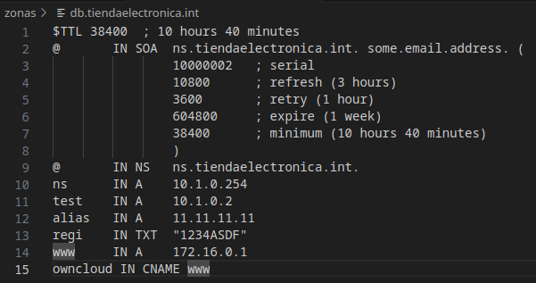

Configuracion named.conf.local

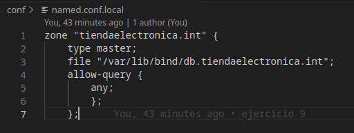

***Comprueba que todo funciona con el comando "dig"***

*Primera comprobación*

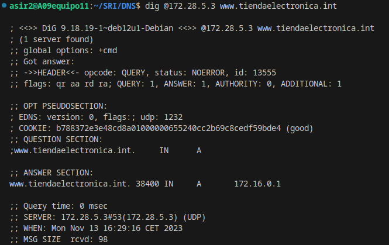

*Segunda comprobación*

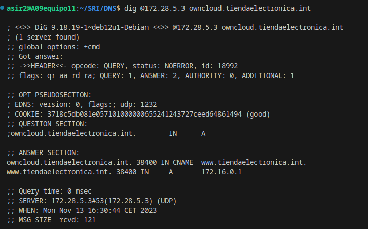

*Tercera comprobación*

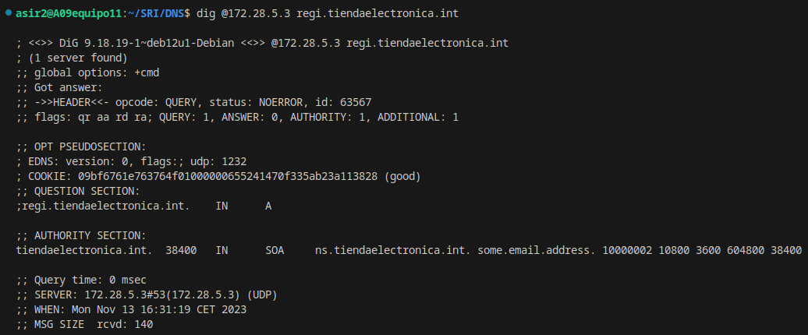
*Muestra en los logs que el servicio arranca correctamente*

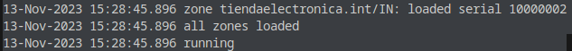
# 11.Realiza el apartado 9 en la máquina virtual con DNS
***Añadimos la zona***:

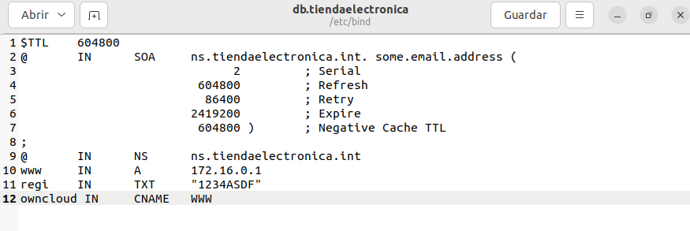
*configuramos named.conf.local*

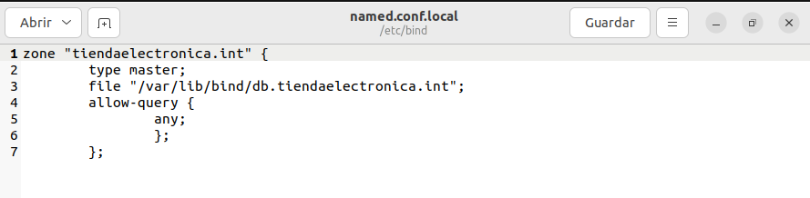

*Comprobación  logs:*
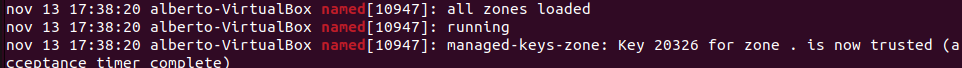

***Comprobación de los digs:***

*Primera comprobación*

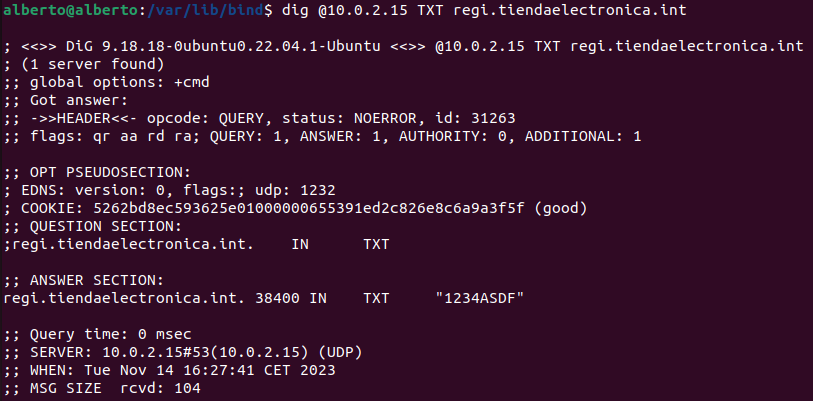

*Segunda comprobación*

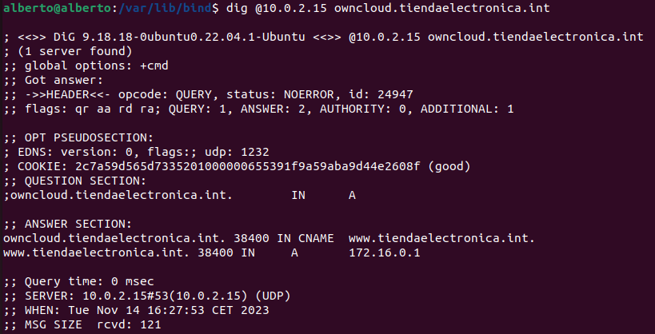

*Tercera comprobación*

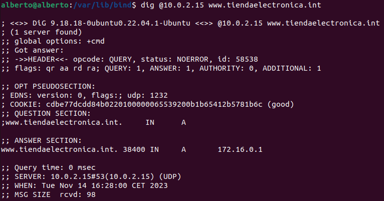

